# 🔐 Censorship-Resistant Proxy Tunnel with Protective DNS

## 🧠 Introduction

In increasingly restricted network environments, maintaining secure, private, and censorship-resistant internet access is a growing challenge for individuals and organisations alike. This project demonstrates the end-to-end deployment of a **cloud-based VLESS-over-TLS proxy tunnel** a modern, high-performance tunnelling solution engineered to evade deep packet inspection (DPI), bypass censorship, and protect DNS queries from surveillance.

Hosted on a **DigitalOcean Ubuntu VPS**, the system leverages **Xray-core** as the proxy engine, **3X-UI** as the web-based management panel, **NekoRay** as the cross-platform client, and **NextDNS** as the protective DNS resolver via **DNS-over-HTTPS (DoH)**. Unlike a traditional VPN, this solution operates over standard TLS port 443, making it indistinguishable from regular HTTPS traffic providing a robust layer of privacy and resilience in censored or monitored environments.

---

## ☁️ Project Overview

**Xray-core** is an open-source, high-performance proxy platform built on the V2Ray framework. It supports a wide range of protocols and transport layers, enabling traffic obfuscation and tunnelling at the application layer.

### Core Capabilities of the Proxy Tunnel:

* **VLESS Protocol** – A lightweight, stateless proxy protocol with minimal overhead and no built-in encryption dependency.
* **TLS 1.3 Encryption** – Industry-standard transport encryption with forward secrecy via ECDHE (X25519).
* **Traffic Obfuscation** – Proxy traffic is encapsulated within TLS, appearing identical to standard HTTPS on port 443.
* **DPI Evasion** – Designed to resist deep packet inspection used by state-level censorship infrastructure.
* **3X-UI Web Panel** – Browser-based management interface for creating and managing inbound proxy configurations.
* **NekoRay Client** – GUI-based cross-platform client for connecting to the proxy tunnel on Windows/Linux.
* **NextDNS (DoH)** – Protective DNS resolver encrypting DNS queries over HTTPS, blocking malware, ads, and DNS surveillance.
* **UUID Authentication** – Secure client identification using randomly generated UUIDs for connection authorisation.

---

## 🔍 Key Components

| Component                         | Description                                                                                      |
| --------------------------------- | ------------------------------------------------------------------------------------------------ |
| **Xray-core**                     | High-performance proxy engine powering the VLESS-over-TLS tunnel                                |
| **3X-UI Panel**                   | Web-based dashboard for managing inbound connections, users, and certificates                   |
| **NekoRay**                       | Cross-platform proxy client for establishing connections from end-user devices                  |
| **NextDNS (DoH)**                 | Encrypted DNS-over-HTTPS resolver providing protective and privacy-preserving DNS               |
| **TLS 1.3 / ECDHE X25519**        | Automated certificate provisioning and TLS 1.3 handshake with X25519 key exchange               |
| **DigitalOcean Ubuntu VPS**       | Cloud server hosting the Xray-core service and 3X-UI management panel                           |
| **VLESS Protocol**                | Lightweight proxy protocol used as the tunnelling layer over TLS transport                      |
| **UUID Authentication**           | Randomly generated unique identifiers used to authenticate client connections                   |

---

## 🧰 Project Implementation Phases

1. **Deployed a DigitalOcean Droplet** (Ubuntu 22.04 LTS, with a registered domain pointed to the server IP)
2. **Installed Xray-core and 3X-UI panel** via automated installation script
3. **Configured TLS certificates** using a domain name for secure HTTPS presentation
4. **Created VLESS-over-TLS inbound** on port 443 with UUID-based authentication
5. **Configured NekoRay client** on the local machine using the exported configuration link
6. **Integrated NextDNS DoH** on the VPS to provide encrypted, protective DNS resolution
7. **Verified tunnel functionality** through censorship bypass, DNS threat blocking, IP masking, and performance testing

---

## 🏗️ System Architecture

### Overall System Architecture

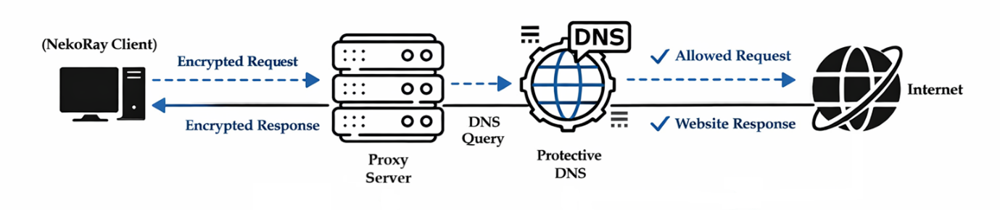

**Explanation:** The system architecture illustrates the interaction between client-side components, the proxy server, and external services. The client device runs NekoRay and routes traffic through the VLESS-over-TLS tunnel to the cloud VPS. DNS queries are resolved through NextDNS DoH, and traffic exits to the internet through the VPS  bypassing any censorship or filtering applied by the local network.

---

### Restricted Network Environment

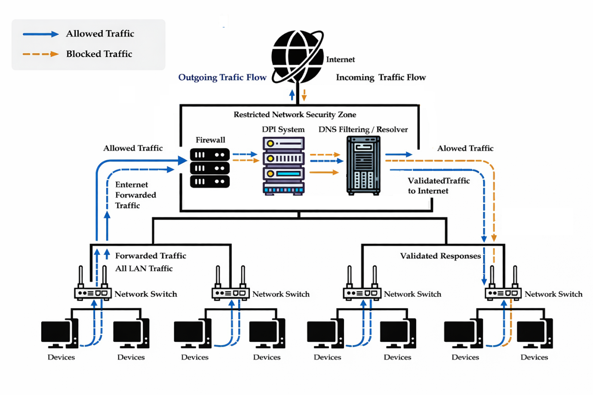

**Explanation:** In a restricted network environment, all user traffic is routed through a centralised security zone consisting of a firewall and a DNS filtering resolver. The firewall applies DPI rules to block non-standard protocols, and the DNS filtering resolver restricts access to categorised domains. This diagram represents the adversarial conditions the proxy tunnel is designed to operate against.

---


### Proxy Network  Blocked Sites

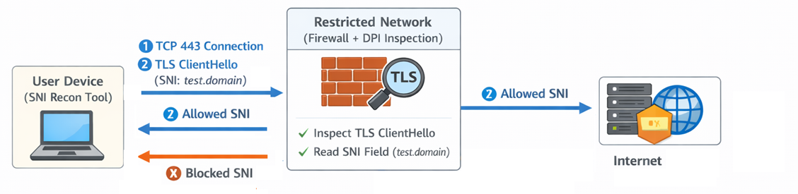

**Explanation:** When a user attempts to access a malicious, phishing, or unsafe domain, the DNS query is forwarded through the encrypted tunnel to NextDNS. The resolver identifies the domain as harmful based on its active blocklists and returns a block response. The malicious content is never loaded, and the block event is logged in the NextDNS dashboard in real time.

---

## ⚙️ Implementation

### 1. 3X-UI Administrative Dashboard

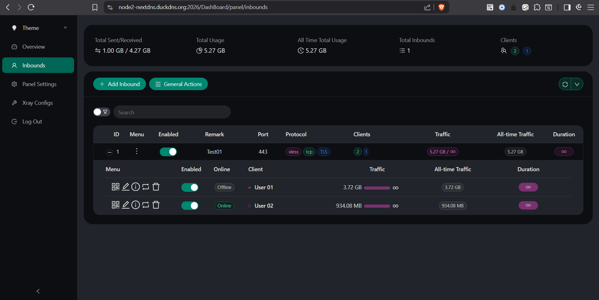

**Explanation:** The 3X-UI administrative dashboard displays active client connections and cumulative traffic statistics. The panel provides a centralised view of all configured inbounds, connected users, upload/download volumes, and system resource usage  enabling real-time monitoring of the proxy infrastructure without requiring direct server CLI access.

---

### 2. VLESS Inbound Configuration

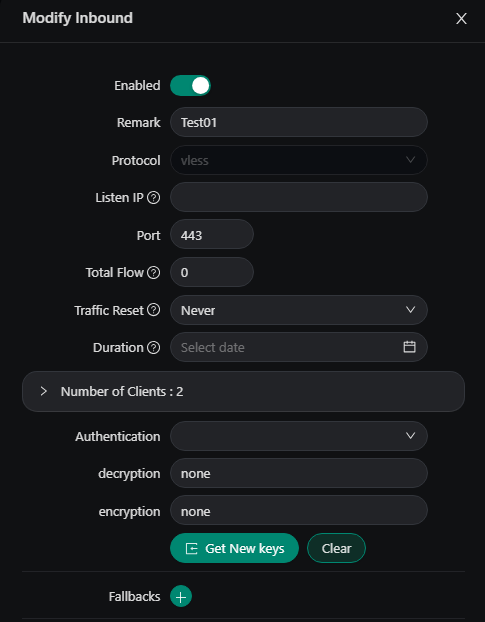

**Explanation:** The 3X-UI inbound configuration confirms the VLESS protocol is active on port 443 with UUID-based client authentication. Each client is assigned a unique UUID that must be present in connection requests for authorisation. This configuration forms the core of the censorship-resistant tunnel  binding the proxy to standard HTTPS port 443 to avoid port-based blocking.

---

### 3. TLS and Transport Settings

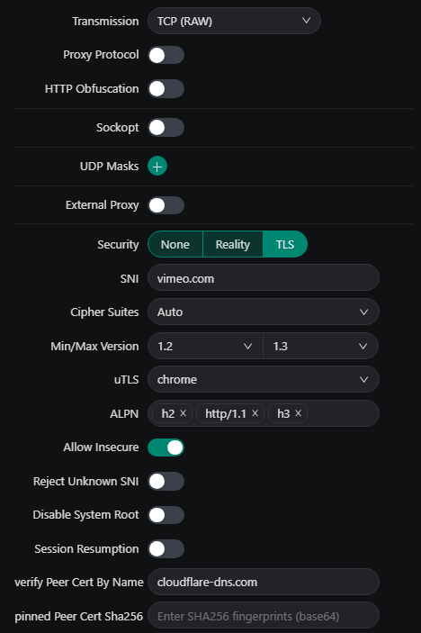

**Explanation:** The transport settings confirm TLS is enabled with a TCP RAW transport layer and a Chrome uTLS fingerprint selected. The Chrome uTLS fingerprint causes the TLS ClientHello to mimic the handshake behaviour of a standard Chrome browser, further reducing the risk of detection by fingerprint-based DPI systems. ALPN values were configured to `h2`, `http/1.1`, and `h3` to match standard browser negotiation behaviour.

---

## 🌐 Protective DNS Integration (NextDNS)

### 4. NextDNS Profile  VPS Linked & DoH Active

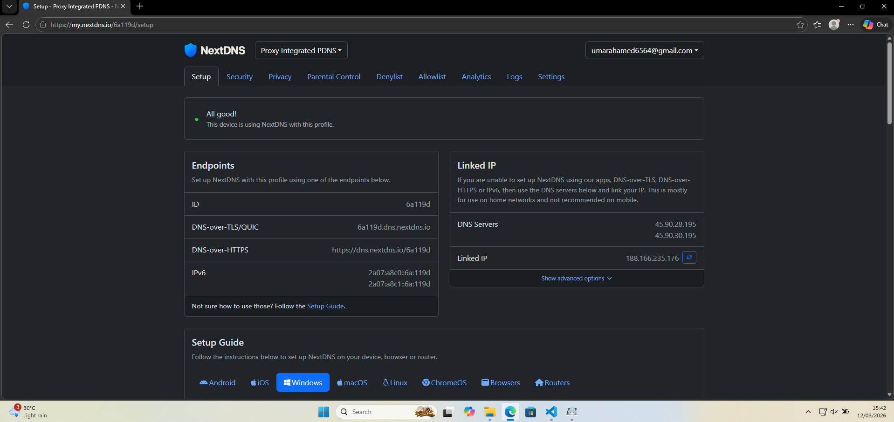

**Explanation:** The NextDNS profile confirms the VPS IP address is linked to the DNS profile and that DNS-over-HTTPS is active. All DNS queries originating from the proxy server are resolved through this profile, ensuring encrypted resolution and the application of all configured security policies regardless of the client's local network conditions.

---

### 5. NextDNS Security Settings

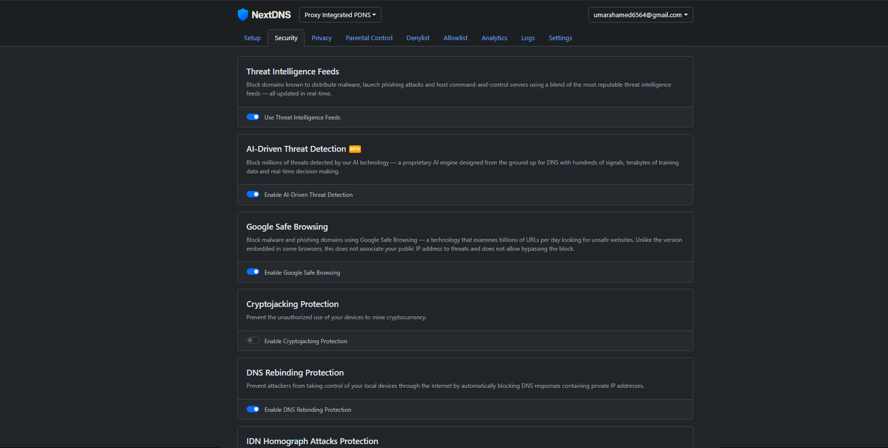

**Explanation:** NextDNS security settings confirm that Threat Intelligence Feeds, AI-Based Detection, Google Safe Browsing integration, and DNS Rebinding Protection are all enabled. These layers collectively provide real-time protection against known malicious domains, zero-day threats, and DNS rebinding attacks  applied automatically to every DNS query resolved through the proxy tunnel.

---

### 6. NextDNS Additional Protections

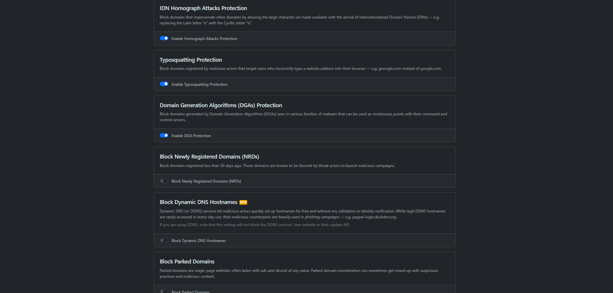

**Explanation:** Additional protections including IDN Homograph Attack Protection, Typosquatting Protection, and Domain Generation Algorithm (DGA) Detection are confirmed active. These defences protect against lookalike domain attacks, misspelled domains used for phishing, and algorithmically generated domains commonly used by malware C2 infrastructure.

---

### 7. NextDNS Privacy Blocklists

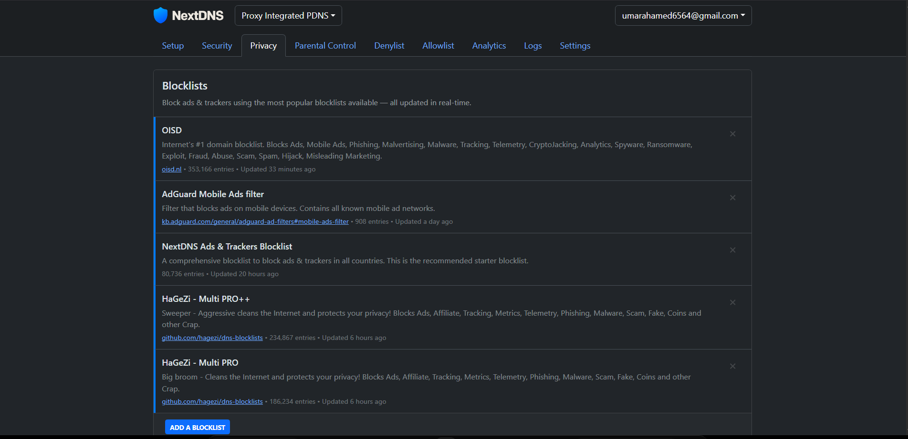

**Explanation:** Five privacy-focused blocklists are active on the NextDNS profile, providing combined coverage of over 850,000 known malicious and unwanted domains. These blocklists are updated in real time without manual intervention, ensuring continuous protection against newly identified threats, ad networks, and tracker domains.

---

## 📱 Client Connection

### 8. NekoRay Client  Active VLESS Connection

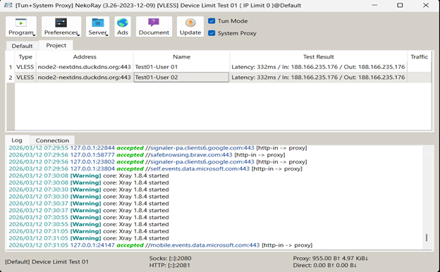

**Explanation:** The NekoRay client confirms an active VLESS connection to the proxy server with a recorded round-trip latency of 332ms. The client establishes a local SOCKS5/HTTP proxy listener and routes all system traffic through the encrypted VLESS-over-TLS tunnel. The active connection state confirms full end-to-end tunnel operation between the client and the VPS.

---


## 🔬 Protocol Stack

```
┌─────────────────────────────────────────────┐
│             Application Layer               │
│         (HTTP / HTTPS / DNS-over-HTTPS)     │
├─────────────────────────────────────────────┤
│              VLESS Protocol                 │
│     (Lightweight Proxy, UUID Auth)          │
├─────────────────────────────────────────────┤
│           TLS 1.3 Transport Layer           │
│  (ECDHE/X25519, AES-256-GCM, HKDF-SHA256)  │
├─────────────────────────────────────────────┤
│               TCP / Port 443                │
│    (Indistinguishable from HTTPS Traffic)   │
├─────────────────────────────────────────────┤
│           Public Internet / VPS             │
│         (DigitalOcean Ubuntu Node)          │
└─────────────────────────────────────────────┘
```

---

## 🆚 Proxy Tunnel vs. Traditional VPN

| Feature                        | This Proxy Tunnel (VLESS/TLS)         | Traditional VPN (OpenVPN / WireGuard)      |
| ------------------------------ | ------------------------------------- | ------------------------------------------ |
| **Protocol Fingerprint**       | Standard HTTPS (port 443)             | Identifiable VPN handshake/protocol        |
| **DPI Resistance**             | ✅ High  blends with web traffic     | ❌ Low  easily fingerprinted and blocked  |
| **Encryption**                 | TLS 1.3 (AES-256-GCM)                 | Varies (AES-256-CBC / ChaCha20)            |
| **Overhead**                   | Minimal (VLESS is headerless)         | Higher protocol overhead                   |
| **Port**                       | 443 (standard HTTPS)                  | Non-standard ports (1194, 51820)           |
| **Censorship Bypass**          | ✅ Effective in restricted networks   | ❌ Commonly blocked by firewalls           |
| **DNS Protection**             | ✅ Integrated via NextDNS DoH         | Partial (depends on implementation)        |
| **Traffic Fingerprinting**     | ✅ Chrome uTLS mimicry                | ❌ Distinct VPN fingerprint                |

---

## 🏢 Practical Deployment Use Cases

### 🔹 1. Journalists and Activists in Censored Regions
The VLESS-over-TLS design is specifically suited for environments where VPNs are blocked by state-level DPI firewalls. Operating on port 443 with a genuine TLS certificate and browser-mimicking fingerprint, the tunnel is indistinguishable from HTTPS traffic.

### 🔹 2. Enterprise Remote Access in Restricted Networks
Organisations operating across regions with strict outbound traffic filtering can deploy this architecture to maintain secure, uninterrupted access to cloud resources and internal systems  without relying on protocols that are easily blocked.

### 🔹 3. Privacy-Conscious Personal Use
For individuals seeking privacy from ISP-level traffic monitoring and DNS surveillance, this setup provides a full-stack privacy solution  combining traffic tunnelling with encrypted DNS resolution through NextDNS DoH.

### 🔹 4. Security Research and Red Team Infrastructure
Penetration testers and red team operators can leverage this infrastructure as part of a covert channel, routing callback traffic through a legitimate-looking HTTPS connection that evades standard network detection rules.

---

## 🧠 Skills Gained

| Category                    | Skills Developed                                                             |
| --------------------------- | ---------------------------------------------------------------------------- |
| **Cloud Infrastructure**    | VPS deployment, domain configuration, and server hardening                  |
| **Network Security**        | TLS 1.3 configuration, certificate management, and encrypted transport       |
| **Protocol Engineering**    | VLESS proxy protocol, Xray-core architecture, and transport layer design     |
| **DNS Security**            | DNS-over-HTTPS integration, DNS leak testing, and protective resolver setup  |
| **Censorship Circumvention**| DPI evasion, traffic obfuscation, and censorship-resistant tunnel deployment |
| **System Administration**   | Service management, panel configuration, and client profile management       |
| **Technical Documentation** | Structured write-up, protocol analysis, and evidence-based explanation       |

---

## 🏁 Conclusion

This project demonstrates how **open-source proxy technologies like Xray-core** can be combined with modern TLS 1.3 encryption and protective DNS to build a practical, scalable, and censorship-resistant tunnel infrastructure. By operating over standard HTTPS port 443 with a genuine TLS certificate and a browser-mimicking fingerprint, the system achieves a level of network invisibility that traditional VPN solutions cannot match  making it a compelling solution for privacy, security research, and circumvention in restricted environments.

---

## 👨‍💻 Built By

**Umar Ahamed**  
Cybersecurity Student • Sri Lanka  
Passionate about **Security, censorship circumvention**, and **privacy engineering.**

⭐ Connect via GitHub: [User-Umar-Ahamed](https://github.com/User-Umar-Ahamed)
